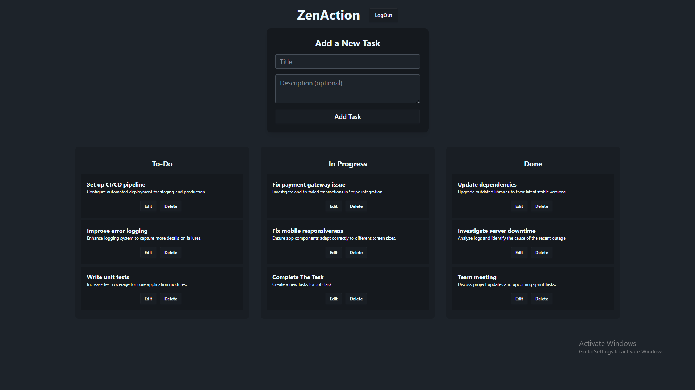

# ZenAction - Task Management

## 🚀 Overview

ZenAction A Task Management Application where users can add, edit, delete, and reorder tasks using a drag-and-drop interface. Tasks are categorized into **To-Do, In Progress, and Done**. Changes are saved instantly to the database for persistence.

## 🎯 Features

- 🔐 **Authentication:** Users must log in via Firebase Google Authentication.
- 📌 **Task Management:** Add, edit, delete, and reorder tasks.
- 📂 **Task Categories:** Tasks are sorted into "To-Do," "In Progress," and "Done."
- 🔄 **Drag & Drop:** Reorder tasks and move them between categories.
- 🛠 **Database Persistence:** Changes sync instantly with MongoDB.
- 📱 **Responsive Design:** Works smoothly on mobile and desktop.
- 🌙 **Dark Mode**, **Activity Log (Not ready yet)**

## 🌍 Live Demo

🔗 [Live Link](https://zen-tesk.onrender.com/)

## 🖼 Screenshots


## 🏗 Tech Stack

- **Frontend:** React (Vite), Tailwind CSS, Firebase Auth
- **Backend:** Node.js, Express.js, MongoDB
- **Drag & Drop:** react-beautiful-dnd / HTML inbuilt feature.
- **Real-time Sync:** MongoDB Change Streams / WebSockets (Not ready yet)

## ⚙️ Dependencies

- react-beautiful-dnd
- firebase
- axios
- dotenv

## 🔧 Installation

1. **Clone the repository:**
   ```sh
   git clone https://github.com/sheikhmuhammadantor/zen-action-client
   cd zen-action-client
   npm install
   npm start
   ```
2. **Environment Variables:**
   Create `.env.local` in the backend with:
   ```env
    VITE_apiKey=**************
    VITE_authDomain=************
    VITE_projectId=***************
    VITE_storageBucket=**************
    VITE_messagingSenderId=*************
    VITE_appId=****************************
    VITE_measurementId=**********************
    VITE_API_URL=http://localhost:4000
   ```

## 📬 API Endpoints

| Method | Endpoint     | Description         |
| ------ | ------------ | ------------------- |
| POST   | `/tasks`     | Add a new task      |
| GET    | `/tasks`     | Retrieve all tasks  |
| PUT    | `/tasks/:id` | Update task details |
| DELETE | `/tasks/:id` | Delete a task       |


Made with ❤️ by [antor](#)
